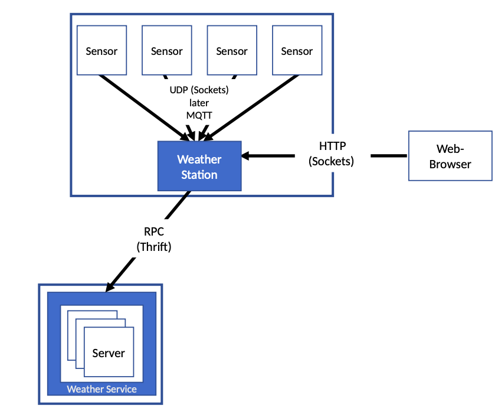

# Weather service

## Project description 

This project was part of the distributed systems lab in summer semester 2019 at Hochschule Darmstadt.
The task was to implement a distributed weather service consisting of 
- sensors (temperature, humidity, rain, wind) : sensors send randomly generated weather data via UDP/ MQTT to their respective weather stations
- weather stations: receive weather data from at least three sensors. Weather stations include a HTTP- server 
which displays the received sensor data via a REST API. Furthermore it transmits the aggregated sensor
data via Thrift to the weather service.
- weather services: weather services gather data from multiple weather stations. They implement a master slave 
architecture and consist of at least three replicated servers which synchronize the received data continuously.  

 

## Build the project

gradle installDist

## Run

`docker-compose up`

Update the start.sh file:
- replace **ip0=0.0.0.0** with your local IP address
- replace **ip1=0.0.0.0** with a remote IP address you want to communicate with

The start.sh script will launch a weather service instance, three weather stations and their respective sensors. 

`./start.sh`

`./stop.sh`

`docker-compose down`

## Weather stations REST API 

### GET

sensors/`sensortype`/`whichdata`

**sensortypes:** 

- temperature
- rain
- wind
- humidity

**whichdata:** 

- current
- history
        